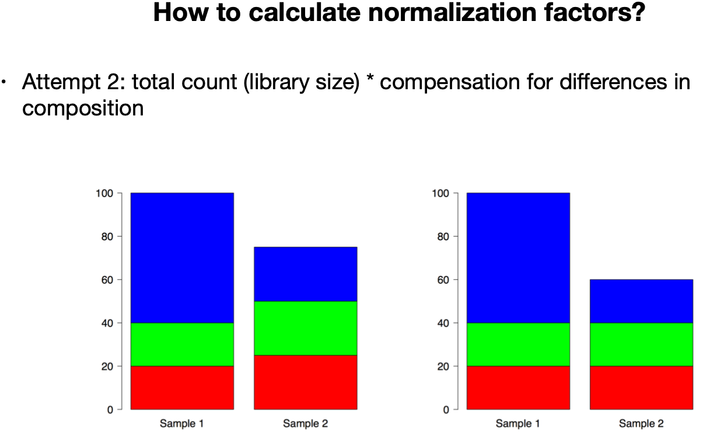

```{r setup, include=FALSE}
# to run locally replace tutorials/02_exploratory_data_analysis/www with inst/tutorials/02_exploratory_data_analysis/www

# to run as an app replace tutorials/02_exploratory_data_analysis/www with www

# libs
library(DESeq2)
library(here)
library(learnr)
library(tidyverse)
library(vsn)

# options
knitr::opts_chunk$set(echo = FALSE)
tutorial_options(
  exercise.reveal_solution=TRUE)

# helpers
source(here("tutorials/02_exploratory_data_analysis/www/featureSelection.R"))

# data
sample_file <- here("tutorials/02_exploratory_data_analysis/www/samples_table.tsv")
samples <- read_tsv(sample_file,col_types=c("cfff"))

# step to reproduce
# ---
# txi <- readRDS(here("inst/tutorials/02_exploratory_data_analysis/www/tximport.rds"))
# counts <- round(txi$counts)
# saveRDS(counts,file=here("inst/tutorials/02_exploratory_data_analysis/www/counts.rds"))
# dds <- DESeqDataSetFromTximport(
#   txi=txi,
#   colData = samples,
#   design = ~ time * treatment)
# dds <- estimateSizeFactors(dds)
# saveRDS(dds,file=here("inst/tutorials/02_exploratory_data_analysis/www/dds.rds"))
# vsd <- varianceStabilizingTransformation(dds, blind=TRUE)
# vst <- assay(vsd)
# vst <- vst - min(vst)
# saveRDS(vst,file=here("inst/tutorials/02_exploratory_data_analysis/www/vst.rds"))
# pc <- prcomp(t(vst))
# percent <- round(summary(pc)$importance[2,]*100)
# conds <- factor(paste(dds$time,dds$treatment))
# sels <- rangeFeatureSelect(counts=vst,conditions=conds,plot=FALSE)
```

## Introduction

In this tutorial, we will take a look at RNA-Seq data retrieved from a study on regulatory T cells; accession **PRJNA369563**.

From the [study abstract](https://www.ebi.ac.uk/ena/browser/view/PRJNA369563?show=xrefs): 

_"Regulatory T cells (Tregs) expressing the transcription factor FOXP3 are crucial mediators of self-tolerance, preventing autoimmune diseases but possibly hampering tumor rejection."_ ... 

_"To gain a comprehensive and unbiased molecular understanding of FOXP3 induction, we performed time-series RNA sequencing (RNA-Seq) and proteomics profiling on the same samples during human iTreg differentiation. To enable the broad analysis of universal FOXP3-inducing pathways, we used five differentiation protocols in parallel."_ ... 

_"Overall design: We performed a time-course experiment including six time points and four iTreg differentiation conditions. We included also a control time series and unstimulated nTregs. Three biological replicates were included. The total sample count is 81. In detail, human naïve CD4+ T cells were magnetically negatively isolated from peripheral blood. Cells were stimulated in serum-free medium with anti-CD3/anti-CD28 antibodies plus IL-2, and samples were taken at 2h, 6h, 24h, 48h and 6d of stimulation. Mock stimulation control cells (sample group G02) received no further compounds, whereas induced regulatory T cells (iTregs) were either differentiated under addition of TGF-b (sample group G03), TGF-b + retinoic acid (sample group G04), TGF-b + retinoic acid + rapamycin (sample group G05) or TGF-b + butyrate (sample group G06). As control, naïve CD4+ T cells were left unstimulated (0h; sample group G01). Ex vivo isolated CD25-high cells were included as positive control for the Treg signature (“nTreg”; sample group G07). Tregs were defined by expression of FOXP3, the “master” transcription factor of Tregs."_

For this tutorial, we selected 3 replicates (A,B and D) of two time points (T03 and T04) of group (G02 and G03).

```{r attention}
quiz(caption="Study design",
  question("Which comparison our selection will allow?",
    answer("TGF-b _vs._ Mock", correct=TRUE),
    answer("24h _vs._ 6h", correct=TRUE),
    answer("48h _vs._ 24h", message = "There are six time points in total, with T01 only for G01 and G07. That was a tough one, as the lack of information makes if difficult to figure out. We should always make sure to provide as clear and complete information as possible."),
    answer("TGF-b + RA _vs._ TGF-b"),
    incorrect="Nope, try again. Multiple answers are correct.",
    allow_retry=TRUE)
)
```

Now that we know more about the study design, we can set about reproducing some of the authors' results or devise and test new hypotheses. For that, we will go through the following steps (this tutorial is focused on the first one solely):

1. Perform an assessment of the data; the so called exploratory data analysis. It will help us decide whether the data is of sufficient quality to answer out biological question.
2. Once satisfied with 1., perform a gene differential expression analysis to identify candidate genes
3. Perform a transcript differential expression analysis to identify candidate transcripts
4. Combine 2. and 3. to look at differential transcript usage
5. Gain more knowledge about the identified candidate genes and transcripts to generate further hypotheses and/or select candidates for follow up studies.

As mentioned, this tutorial focuses on point 1, which includes the following steps

1.
  1. gather the data and its metadata, and import it into `R` learning more about useful functions to do so, as well as about the properties of _RNA-Seq_ data.
  2. perform an exploratory data analysis (EDA) of the raw data (as we did in the previous tutorial)
  3. normalize the data, so as to make it comparable between samples, further highlighting _RNA-Seq_ data properties
  4. perform an EDA on the normalised data
  5. conclude whether we can move onto point 2. or if countermeasures need to be taken to ensure our question can be answered

## Metadata

We have translated the information from the study abstract into a file called [samples_table.tsv](tutorials/02_exploratory_data_analysis/www/samples_table.tsv), which looks like:

```{r sample,echo=FALSE}
read_tsv(here("tutorials/02_exploratory_data_analysis/www/samples_table.tsv"),show_col_types=FALSE)
```

The metadata looks pretty _tidy_, let us see how we can load it in R.

### Tidyverse

`tidyverse` and the `readr` package in particular provide a lot of functionality to read in tabular format in `R`. While this is nothing "new" compared to _base_ `R`, `readr` put a strong accent on doing it as safely as possible, informing the end-user about any issues it encounters. This may appear superficial but it is in reality a game-changer as it means that a lot of the assumptions you might have about your data will be challenged and it will give you the heads-up if any of these fails. It will end-up saving you a lot of time and preventing a lot of non-trivial errors to propagate throughout your analyses. 

The corresponding [Chapter 11](https://r4ds.had.co.nz/data-import.html#getting-started) in [R for Data Science](https://r4ds.had.co.nz) by Hadley Wickham gives great details about this.

Write the code to import the data in `R`

```{r metadata, exercise=TRUE, exercise.eval=TRUE, exercise.lines = 5}
library(here)
library(readr)
sample_file <- here("tutorials/02_exploratory_data_analysis/www/samples_table.tsv")

```

```{r metadata-hint}
?read_tsv
```

```{r metadata-solution}
samples <- read_tsv(sample_file)
```

  **Notes:**

  1. the library `here` is an essential library to ensure reproducibility. You might be familiar with _base_ `R` `setwd()` (set working directory) function? The `here()` function is similar but unlike `setwd()` that defines the directory according to your computer (_e.g._ `/home/delhomme/some-project`), it dynamically defines that directory based on the computer it is on. So on someone else's computer it will resolve to _e.g._ `/home/bastian/some-project`. It might seem trivial, but it makes the code truly portable, hence reproducible out of the box.
  2. the function `read_tsv` is only one of many functions from the `readr` package. Check its [cheatsheet](https://readr.tidyverse.org/index.html#cheatsheet). You can also read in data directly from a Google Sheet!
  3. [chapter 11](https://r4ds.had.co.nz/data-import.html#getting-started) explains in great details the mechanism of how `readr` parses the data and how you can fine tune it to your needs. While this is relatively infrequent in practice, it is good to know where to look for, whenever needed.

---

There is a lot more options that can be used to tune importing the data. The `R` language has its origin has a statistical language. Many of the variables we have in our metadata are actually categorical variables, which are best represented in `R` as `factor`s. Re-read the metadata setting the relevant columns as factors.

```{r metadata2, exercise=TRUE, exercise.eval=TRUE, message=FALSE, exercise.setup="metadata"}
sample_file <- here("tutorials/02_exploratory_data_analysis/www/samples_table.tsv")
samples <- read_tsv(sample_file)
```

```{r metadata2-hint}
read_tsv(...,col_types=...)
```

```{r metadata2-solution}
# multiple solutions are possible
# using a string
samples <- read_tsv(sample_file,col_types=c("cfff"))
samples
# setting a default overall
samples <- read_tsv(sample_file,col_types=cols(.default=col_factor()))
samples
# or you can have an extensive control of all variables.
# if you replace cols() with cols_only(), you can control the columns that are kept
samples <- read_tsv(sample_file,col_types=cols(sample_id=col_character(),
                                               replicate=col_factor(),
                                               time=col_factor(),
                                               treatment=col_factor()))
samples
# sometimes you just want the defaults, but also want it to be quiet 
# (not a solution to the question though! but as good as any a place to mention it)
samples <- read_tsv(sample_file,show_col_types=FALSE)
```

Alright, half of the work done, remains to load the data.

## Count data

RNA-Seq data measures mRNA fragments, so it is aimed at quantifying the expression of genes, _i.e._ the first step of the central dogma `DNA->RNA->protein`. But as we know, biology is much more complex (_"Biology is too important to be left to the biologists"_ - attributed to _Niels Bohr_ to his then student _Max Delbrück_ - yes the founder of molecular biology as we know it).

One advantage is that it also captures, in higher eukaryotes, splicing variants.

](images/DNA_alternative_splicing.gif){width=80%}

There are several caveats too, which we need to keep in mind.

```{r caveats}
quiz(caption="RNA-Seq caveats",
     question("Which of the following are likely caveats of bulk RNA-Seq",
              answer("averages a population of 10^6 cells"),
              answer("consists of a mix of cells of different origins"),
              answer("cells sampled at a very exact timepoint",message="biological processes stop the exact moment you freeze the sample"),
              answer("all of the above and more - keep a critical mind!",correct=TRUE)
     ),
     question("What of single cell RNA-Seq?",
              answer("very low material, some transcript are present in less than a copy/cell"),
              answer("sequencing depth is limited, large drop-out effect"),
              answer("signal can be drown out by strong biological processes (_e.g._ cell cycle)"),
              answer("all of the above and more - keep a critical mind!",correct=TRUE)
     ))
```

Nonetheless, RNA-Seq is the best tool we have for now (!) for doing expression quantification. But it is **at best** a proxy and only one layer of gene regulation (mRNA half-life, mRNA storage, post-transcriptional modification, editing, _etc._).

---

On the brighter side, what can we do with count data? A lot!

1. Look whether the total output of a gene changes between conditions: Differential Gene Expression (DGE)
2. The same at the transcript (splicing isoform) level: Differential Transcript Expression (DTE)
3. Assess whether any isoform of a given gene changes: DTE+G
4. Does the isoform composition of a given gene change: Differential Transcript Usage (DTU)
5. Does anything change? [Gene Differential Expression (GDE)](https://liorpachter.wordpress.com/2018/02/15/gde%C2%B2-dge%C2%B2-dtu%C2%B2-dte%E2%82%81%C2%B2-dte%E2%82%82%C2%B2/)

{width=80%}

---

### Counts properties

#### Relative

Counts have many properties, which we will see in the following, but most importantly, they are **relative** abundances. Indeed, they
1. originate from transcripts of different length
2. are part of sequenced pools of different size (sequencing depth)

---

#### Units

An important note on units. You may have heard of `RPKM`, `FPKM`, `TPM`. These are all metrics used for RNA-Seq and they have been used for years. Tools for differential expression do **NOT** use any of these and for good reasons (more below). 

All three units will be affected by genes with very high counts, which have high variance and disproportionately influence estimators like the total sum. They merely normalise all expression values using a single ratio, scaling to a final library size equivalent to one million

`RPKM/FPKM` (read/fragment per kilobase of transcript per million reads in the library) are even more sensitive to this than the `TPM` as they integrate the actual library size as part of the calculation instead of that of an arbitrary library size of one million.

[Here](https://docs.google.com/document/d/1D5CoNPxy45MpXLLvbIImFzCebF-fe0jD5KLeAQibGTI) is a document we have used for years to convince authors and editors that these measures are flawed. This has now become mainstream with many studies highlighting the risks of using such measures for differential expression. 

`TPM` are still being reported by many tools and using them for summary statistics and visualisation at the sample level is broadly accepted.

---

#### Statistical consideration

Counts have the following properties:

1. variance depends on the mean count
2. counts are non-negative and highly skewed

<br/>
<br/>

](images/Heteroscedasticity.png)

---

Such characteristics are well modeled by a Poisson distribution with its single parameter lambda: 

$\lambda = mean = variance$

$$\vartheta^{2} = \mu$$

](images/Poisson_pmf.svg)

The Poisson distribution represents well technical replicates (where mRNA proportions are identical across samples), but cannot account for the over-dispersion observed across biological replicates. We need a distribution that can account for that, _i.e._ that allows for the mRNA proportions to vary across samples. That generalisation is the **negative binomial** distribution. 

$$\vartheta^{2} = \mu + \theta\mu^{2} $$
where $\theta$ is the dispersion and $\sqrt{\theta}$ is the "biological coefficient of variation".

---

_Fun fact_:
  The negative binomial is the best model for tornadoes in the US tornado alley, _c.f._ [Nouri et _al._, 2021](https://www.nature.com/articles/s41598-021-81143-5). 

_trivia_: 
  It is a 100% `ggplot2` manuscript...

---

More seriously, the negative binomial is the best model we have for the time being for RNA-Seq data - **All models are wrong but some are useful - George E. P. Box**.

As a matter of fact, differential expression models that have more than one variable are extremely computationally expensive to compute using a negative binomial model, hence they rely on _generalized linear model_ instead.

### `tximport`

Quantification of expression profiling data from most commonly used tools (_e.g._ salmon, rsem, stringtie, kallisto) can be imported in `R` using the `tximport` [package](https://doi.org/doi:10.18129/B9.bioc.tximport).

_"Imports transcript-level abundance, estimated counts and transcript lengths, and summarizes into matrices for use with downstream gene-level analysis packages. Average transcript length, weighted by sample-specific transcript abundance estimates, is provided as a matrix which can be used as an offset for different expression of gene-level counts."_ [Soneson, Love, Robinson](https://doi.org/10.12688/f1000research.7563.1)

In the frame of this tutorial, the salmon quantification files have been processed as follows:
```{r txi_mock, eval=FALSE, echo=TRUE}
txi <- tximport(<QUANT.SF_FILES>,type="salmon",tx2gene=<TX2GENE>,varReduce=TRUE)
```

where `<QUANT.SF_FILES>` was the character vector of the salmon results' quant.sf files, <TX2GENE> is a simple tab delimited file containing for every transcript ID, the corresponding gene ID. Note that salmon was used in a mode that bootstraps the quantification (since it is an expectation-maximisation process) typically a 100 times. This allows to devise per-sample inferential replicate information, which was then summarised by setting `varReduce=TRUE`. The `txi` object was saved and we now load it into our session.

```{r tximport, exercise=TRUE, exercise.eval=FALSE, exercise.setup="metadata2"}
txi <- readRDS(here("tutorials/02_exploratory_data_analysis/www/tximport.rds"))

```

```{r tximport-hint}
?str
```

```{r tximport-solution}
str(txi)
```

Take a look at the object (use the code block above). Make sure *NOT* to call `txi` as this will most probably time-out.

```{r tximport-quiz}
quiz(caption="`tximport` object",
     question("What is it?",
              answer("a list",correct=TRUE),
              answer("a data.frame"),
              answer("an S4 object")),
     question("How many values are stored in it?",
              answer("1"),
              answer("3"),
              answer("5",correct=TRUE),
              answer("7")),
     question("How many samples and how many genes were reported?",
              answer("12, 60168",correct=TRUE),
              answer("60168, 12"),
              answer("5, 60168")),
     question("Looking at the value names, what is the difference between 'abundance' and 'counts'?",
              answer("Both are counts",correct=TRUE),
              answer("The first is reported in TPM",correct=TRUE),
              answer("The second is the raw estimates reported by salmon",correct=TRUE),
              incorrect="All are true, as `countsFromAbundance` is `no`"
              ),
     question("What about the 'length', what does it contain?",
              answer("The expected length of the transcripts."),
              answer("The observed length of the transcripts",correct=TRUE),
              answer("The length of the transcripts normalised for the read length")
              ),
     question("What about 'variance'?",
              answer("the summarised per-sample inferential replicate information",correct=TRUE),
              answer("the variance of the 'length'"),
              answer("the variance of the 'abundance'"),
              incorrect="Reread what is just above that quiz :-)"
              )
     )
```

### `tximeta`

We have now seen `tximport` but very often you would want to get more than the gene ID and might like to have the gene name, symbol, description, _etc._ associated with the count information already. This is possible using the [`tximeta`](http://bioconductor.org/packages/release/bioc/vignettes/tximeta/inst/doc/tximeta.html) package. We will not look at it as part of this tutorial, so this is for your reference only. We will later in the course learn how to retrieve such information and associate it with our results.

---

Now that we have a good idea of our data and metadata, let us look at them!

## Exploratory Data Analysis

We will start by extracting the counts that we need. 

```{r count-quiz}
quiz(caption="raw or TPM, that is the question",
     question("Which of 'abundance' or 'counts' should be retrieved?",
              answer("counts, provided 'countsFromAbundance=no'",correct=TRUE),
              answer("counts",message="That is only a partially correct answer"),
              answer("abundance",message="rather not, these are TPMs. Unless you know what you are doing and aware of the possible caveats.")
     ))
```

Write the code to extract the counts and apply a function to convert them to integers.

```{r counts, exercise=TRUE, exercise.eval=FALSE, exercise.setup="tximport"}

```

```{r counts-hint}
?round
?`$`
```

```{r counts-solution}
counts <- round(txi$counts)
```

Now, it is very important that we do some sanity checking. Our metadata and data are two **SEPARATE** entities. We need to ensure that they are from the same studies, that samples are the same and most importantly sorted in the same order! Give it a try.
```{r counts-pre, include=FALSE}
counts <- readRDS(here("tutorials/02_exploratory_data_analysis/www/counts.rds"))
```

```{r sanity, exercise=TRUE, exercise.eval=FALSE, exercise.setup="counts-pre"}

```

```{r sanity-hint}
?colnames
?`==`
?all
?stopifnot
```

```{r sanity-solution}
stopifnot(all(colnames(counts) ==  samples$sample_id))
```

Hurrah! Our metadata and data reference the same samples, in the same order!

```{r sanity-quizz}
quiz(caption="Does it matter?",
     question("Does it?",
              answer("Sure! You did not swap the samples in the wet lab, why do it in the dry one?",
                     correct=TRUE),
              answer("No, it does not, R or whatever package will fix it for me",
                     message="That would be nice")
     ))
```

### Raw data

#### Never-observed-events proportion

One of the first question is to figure out how many of the genes are never observed in any of the samples. Write the code to get that as a percentage of the total number of genes

```{r noexp, exercise=TRUE, exercise.eval=FALSE, exercise.setup="sanity"}

```

```{r noexp-hint}
?rowSums
?`==`
?nrow
```

```{r noexp-solution}
sel <- rowSums(counts) == 0
sprintf("%s%% percent (%s) of %s genes are not expressed",
        round(sum(sel) * 100/ nrow(counts),digits=1),
        sum(sel),
        nrow(counts))
```

```{r noexp-quiz}
quiz(caption="Assumption",
     question("Was that an amount you expected?",
              answer("Yes",correct=TRUE),
              answer("No",message="This is actually also a valid answer"),
              post_message="Whichever your answer, keep your arguments so we can discuss them."
     ))
```

#### Sequencing depth (SD)
Another important initial assessment is to evaluate the discrepancy (if any) in sequencing depth. For that, visualise the sum of counts per samples. For this, you will use `ggplot` but you will also need to create the necessary data. For that we will need the `tibble` package `tibble()` constructor and the `dplyr` package `%>%` pipe and `bind_cols()` function. For that, both the tidyverse [webpage](https://www.tidyverse.org/) and the corresponding [cheatsheets](https://www.rstudio.com/resources/cheatsheets/) are extremely useful.

First, write the code to reproduce the following object:
```{r tibble-view, echo=FALSE, eval=TRUE}
counts <- readRDS(file=here("tutorials/02_exploratory_data_analysis/www/counts.rds"))
tibble(x=colnames(counts),
       y=colSums(counts)) %>% 
  bind_cols(samples)
```

```{r tibble,  exercise=TRUE, exercise.eval=FALSE, exercise.setup="noexp"}

```

```{r tibble-hint}
?tibble
?`%>%`
?bind_cols
```

```{r tibble-solution}
dat <- tibble(x=colnames(counts),y=colSums(counts)) %>% 
  bind_cols(samples)
```

Now that we have the data in the correct shape, visualise it using ggplot.

```{r barplot, exercise=TRUE, exercise.eval=FALSE, exercise.lines = 10, exercise.setup="tibble"}
dat <- tibble(x=colnames(counts),y=colSums(counts)) %>% 
  bind_cols(samples)

```

```{r barplot-hint-1}
?geom_col
?facet_grid
```

```{r barplot-hint-2}
ggplot(dat,aes(x,y,fill=CHANGEME)) + 
  geom_col() + 
  scale_y_continuous(name="reads") +
  facet_grid(~ factor(CHANGEME), scales = "free") +
  theme_bw() + 
  theme(axis.text.x=element_text(angle=90,size=6),
        axis.title.x=element_blank())
```

```{r barplot-solution}
ggplot(dat,aes(x,y,fill=treatment)) + 
  geom_col() + 
  scale_y_continuous(name="reads") +
  facet_grid(~ time, scales = "free") +
  theme_bw() + 
  theme(axis.text.x=element_text(angle=90,size=6),
        axis.title.x=element_blank())
```

```{r barplot-quiz}
quiz(caption="Evaluation",
     question("Is there something unexpected in that plot?",
              answer("No"),
              answer("Yes, sample SRR...570 is clearly undersampled in comparison to the others",
                     correct=TRUE)))
```

#### SD per sample
As we just saw, all but one sample have comparatively similar sequencing depth (15-25 M reads). That previous visualisation however does not inform us on the distribution of reads within individual samples. To achieve this we will again need to transform the data. We will convert the counts onto a log10 scale and store them in a `data.frame()`. Then we will use the `tibble` package `rownames_to_column()`, `tidyr` `pivot_longer` and `dplyr` `starts_with()` and `left_join()` functions to convert the data and associate it with the sample information. Write the code to reproduce the following table.

```{r pivot-view, echo=FALSE, eval=TRUE}
as.data.frame(log10(counts)) %>% 
  rownames_to_column() %>% 
  pivot_longer(starts_with("SRR"),
               names_to="sample_id",
               values_to="x") %>% 
  left_join(samples %>% select(-replicate),by=c("sample_id"))
```

```{r pivot, exercise=TRUE, exercise.eval=FALSE, exercise.setup="barplot"}

```

```{r pivot-hint-1}
?as.data.frame
?log10
?rownames_to_column
?pivot_longer
?starts_with
?left_join
```

```{r pivot-hint-2}
dat <- as.data.frame(LOG_DATA) %>% 
  rownames_to_column() %>% 
  pivot_longer(starts_with(COUNT_DATA_COLUMNS_PREFIX),
               names_to="sample_id",
               values_to="x") %>% 
  left_join(samples %>% select(-replicate),by=c("sample_id"))
```

```{r pivot-solution}
dat <- as.data.frame(log10(counts)) %>% 
  rownames_to_column() %>% 
  pivot_longer(starts_with("SRR"),
               names_to="sample_id",
               values_to="x") %>% 
  left_join(samples %>% select(-replicate),by=c("sample_id"))
```

Now that we have the data in the right shape, we can visualise it. For that we can use the density geom, and as while we want to visualise the individual samples, we need to have a corresponding `group` aesthetic.

```{r density, exercise=TRUE, exercise.eval=FALSE, exercise.lines=18, exercise.setup="pivot"}
dat <- as.data.frame(log10(counts)) %>% 
  rownames_to_column() %>% 
  pivot_longer(starts_with("SRR"),
               names_to="sample_id",
               values_to="x") %>% 
  left_join(samples %>% select(-replicate),by=c("sample_id"))
```

```{r density-hint-1}
?geom_density
?aes
```

```{r density-hint-2}
ggplot(dat,aes(x=x,group=GROUP,col=COLOR)) + 
  geom_density(na.rm = TRUE) + 
  ggtitle("sample raw counts distribution") +
  scale_x_continuous(name="per gene raw counts (log10)") + 
  theme_bw()
```

```{r density-solution}
ggplot(dat,aes(x=x,group=sample_id,col=treatment)) + 
  geom_density(na.rm = TRUE) + 
  ggtitle("sample raw counts distribution") +
  scale_x_continuous(name="per gene raw counts (log10)")

ggplot(dat,aes(x=x,group=sample_id,col=treatment)) + 
  geom_density(na.rm = TRUE) + 
  ggtitle("sample raw counts distribution") +
  scale_x_continuous(name="per gene raw counts (log10)") +
  facet_grid(~ time, scales = "free")
```

All samples seem to have a similar distribution, with one replicate (`SRR...570`) showing clear shift toward the left of its overall distribution. Apart from that, its distribution shape is similar to the others. 

```{r density-quizz}
quiz(caption="What's next",
     question("What would you do about that sample?",
              answer("Proceed with it",correct=TRUE),
              answer("Drop it",message="On what justification? So far we only know it is not sequenced as deep as the others."),
              answer("Ask the wet-lab or sequencing facility if there is still some material available for a sequencing re-run.", correct=TRUE)))
```

### Normalisation

The property of the raw data looks acceptable, with the drawback that one sample might be under-sampled. We will now normalise the data so as to be able to compare between samples.

#### Principles
We know we need to address the following caveats:

1. Counts are relative to their sample
2. Sequencing depth is variable across samples
3. Counts variance depends on the mean count (heteroscedastic)
4. Counts are non-negative and highly skewed (data follows a negative binomial distribution)

---

How do we address 1. and 2.?

A naive approach such as that used by TPM and RPKM/FPKM is flawed. So calculating a normalisation factor using _e.g._ 
$$\sum_{c_{i}}/\sum_{c_{ref}}$$
where $c_{i}$ are the counts from one sample and $c_{ref}$ the counts from a reference sample (one pseudo average sample or one selected sample) would result in the following:

{width=80%}

Clearly, this would fail at correcting for the influence of the sample RNA composition.

What if we make the assumption that **most genes are not differentially expressed** (**THIS** is the most critical assumption we do for Differential Expression!)?

$$\sum_{c_{i}l_{i}}/\sum_{c_{ref}}$$
where $l_{i}$ is a weight for compensating for the  difference in library composition.

{width=80%}

That is much more like it! This is what packages like `edgeR` and `DESeq2` will do for you. For example, `edgeR` will apply method called "TMM", the `trimmed mean of medians` to calculate that normalisation factor, _a.k.a_ size factor, _i.e._ the ratio correcting for the difference in sequencing depth.

---

#### Setup

Now that we know the theory, put it in practice using the `DESeq2` package. First, create a `DESeqDataSet` object from your `txi` and `samples` objects. It will require that we set a `design`. For this, recall the very beginning of this tutorial and that we agreed on the fact that the variables `treatment` and `time` as being of interest. The design is what tells `DESeq2` how we want to model the expression values.

$$expression = f(treatment + time + treatment:time)$$
We will revisit this concept in the next tutorial, for now, just know that in `R`, we write the previous equation as `~ time * treatment`

```{r dds, exercise=TRUE, exercise.eval=FALSE, exercise.setup="tximport"}
suppressPackageStartupMessages(library(DESeq2))
```

_Note:_ `suppressPackageStartupMessages()` is very useful to silence all messages and warnings that `R` rpoduces when loading a package. However, one should be careful as these messages can point to issues such as the overloading of functionalities of packages previously loaded.

```{r dds-hint}
?DESeqDataSetFromTximport
```

```{r dds-solution}
dds <- DESeqDataSetFromTximport(
  txi=txi,
  colData = samples,
  design = ~ time * treatment)
```

 **Note:**
See the warning we got? Well, up there reading the metadata, the last command reset samples to have all columns as characters. This is `R` default since version 4, but in previous versions, factors were the default to represent alphanumeric values.

```{r dds-rds, include=FALSE}
dds <- readRDS(here("tutorials/02_exploratory_data_analysis/www/dds.rds"))
```

Before we proceed, take a few instants to familiarise with the `DESeqDataSet` object.
```{r dds-what, exercise=TRUE, exercise.eval=FALSE, exercise.setup="dds-rds"}
dds
colData(dds)
colnames(dds)
head(rownames(dds))
head(assay(dds))
head(assay(dds,"avgTxLength"))
metadata(dds)
```

If you observe the example above, you will realise that all the function calls past the first view of the `dds` object are using `accessor` functions that are named after the `slot` of the object. This is part of the good coding practice in `R` and something you should come to expect when working with `S4-6` objects.

---

#### Size factors

Now that we have the object ready, we can estimate the normalisation factor for the difference in sequencing depth using `DESeq2` `estimateSizeFactors()` function. Write the code to do so.

```{r size_factors, exercise=TRUE, exercise.eval=FALSE, exercise.setup="dds-rds"}

```

```{r size_factors-hint}
?estimateSizeFactors
```

```{r size_factors-solution}
dds <- estimateSizeFactors(dds)
```

As you may observe, `DESeq2` informs us that it will use the average transcript length to correct the expression values. The size factor will be calculated per gene per library, so the `DESeq2` function `normalizationFactor()` will return a matrix. Our next assessment is to figure out how (dis)similar these factors are across our dataset. Revisit the code we wrote for visualising the raw data count distribution per sample to visualise the normalisation factor. Instead of a `geom_bar()`, try to use a `geom_violin()`

```{r norm_factor, exercise=TRUE, exercise.eval=FALSE, exercise.setup="dds-rds"}

```

```{r norm_factor-hint}
?as.data.frame
?normalizationFactors
?rownames_to_column
?pivot_longer
?starts_with
?geom_violin
```

```{r norm_factor-solution}
 ggplot(as.data.frame(normalizationFactors(dds)) %>% 
          rownames_to_column() %>% pivot_longer(starts_with("SRR"),
                                                names_to="sample_id",
                                                values_to="size_factor"),
        aes(x=sample_id,y=size_factor)) + 
  geom_violin() + 
  ylim(c(0,2)) + 
  theme(axis.text.x=element_text(angle=90,size=6),
        axis.title.x=element_blank())
```

---

#### Heteroscedasticity

Now that we have seen how the library size normalisation works, and that most libraries have a very narrow, hence, highly specific normalisation factor across genes per sample (which is a first indication that our major assumption holds!), we can look into the 3. and 4. properties of the data and how we can normalise that. The issues with these points are:

3. All parametric statistics rely on the assumption that the variance is independent of the mean.
4. errors are multiplicative on a linear scale

---

**Important note** DESeq2 and edgeR only models the parameters, they will **always** (!) use the raw counts in their calculation. There is a possibility to extract the normalised counts from both packages, _e.g._ `DESeq2` `counts(dds,normalised=TRUE)` function call.

---

#### Variance Stabilising Transformation

To address both issues 3. and 4. (that are by the way not corrected when you export using `DESeq2` `counts(dds,normalised=TRUE)` function call), we will use another `DESeq2` function called `varianceStabilizingTransformation()`

```{r vst, exercise=TRUE, exercise.eval=FALSE, exercise.timelimit=600, exercise.setup="dds-rds"}
vsd <- varianceStabilizingTransformation(dds, blind=TRUE)
vst <- assay(vsd)
vst <- vst - min(vst)
```

_Note_
1. `vst()` is also a function in `DESeq2`. It does the same as `varianceStabilizingTransformation()` but on a smaller random subset of the data. So it is much faster, but possibly less accurate. This might be useful for EDA on large dataset, but not it you want to do any statistical tests on that normalised data.
2. The `blind` argument controls whether the design should be used as a prior to the transformation, _i.e._ if the variance should be estimated across all samples (`TRUE`) or per replicates as defined by the design. You would want the former when you are performing an exploratory analysis, so as not to bias your results, while you would want to set it to `FALSE` when you are satisfied that your design is the best model for your data, so as to increase the transformation results' accuracy.

We can look now at what the `vst` has achieved.

```{r vst-rds, include=FALSE}
counts <- readRDS(here("tutorials/02_exploratory_data_analysis/www/counts.rds"))
dds <- readRDS(here("tutorials/02_exploratory_data_analysis/www/dds.rds"))
vst <- readRDS(here("tutorials/02_exploratory_data_analysis/www/vst.rds"))
```


```{r htrscdstc, exercise=TRUE, exercise.eval=FALSE, exercise.setup="vst-rds"}
library(vsn)
meanSdPlot(counts[rowSums(counts)>0,])
meanSdPlot(counts(dds)[rowSums(counts(dds))>0,])
meanSdPlot(log1p(counts(dds))[rowSums(counts(dds))>0,])
meanSdPlot(log1p(counts(dds,normalized=TRUE))[rowSums(counts(dds))>0,])
meanSdPlot(log1p(counts(dds,normalized=TRUE))[rowSums(counts(dds,normalized=TRUE))>0,])
meanSdPlot(vst[rowSums(vst)>0,])
```

### Visualisation

Now, we will focus on a number of visualisation to perform the EDA of the normalised data. The most common visualisations are Principal Component Analysis ([PCA](https://en.wikipedia.org/wiki/Principal_component_analysis)) and [heat maps](https://en.wikipedia.org/wiki/Heat_map).

#### PCA

The first step is to actually perform the PCA before visualising it. What we are interested in is to assess how similar samples are to each other. For that, we can use the _base_ `R` `prcomp` function. That function calculates the PCA by rows, so we will need to transpose our normalised data `t()` prior to computing the PCA. There is no need to re-invent that wheel, so just run the code below :-)

```{r prcomp, exercise=TRUE, exercise.eval=TRUE, exercise.setup="vst-rds"}
pc <- prcomp(t(vst))
(percent <- round(summary(pc)$importance[2,]*100))
```

_Note_ Adding a pair of parenthesis `()` around an assignment function is a neat trick in `R` to both perform the assignment and print the result of the function call in the console.

```{r prcomp-quiz}
quiz(caption="What does a PCA tells us?",
     question("What are the numbers reported",
              answer("The percentage of variance explained per components",correct=TRUE),
              answer("The number of genes (data points) whose variance best defines the components")))
```

We will now look at a scree plot and a 2D plot of the components. For you reference, there exists a fantastic package to analyses PCA plots: [PCAtools](https://bioconductor.org/packages/devel/bioc/vignettes/PCAtools/inst/doc/PCAtools.html)

---

A scree plot is a plot that visualise the cumulative variance explained by the components. It is useful to determine how many components are needed to explain most of the variance in the data, it will help us assess whether that number of components could be in agreement with the number of variables as well as with the number of possible combinations of their values.

Again, here we can ignore the code and focus on the interpretation of the scree plot.

```{r scree, exercise=TRUE, exercise.eval=FALSE, exercise.setup="prcomp"}
# variables in the model
vars <- all.vars(design(dds))
# number of variables
nvar <- length(vars)
# dynamic programming to find out the number of combinations of the variables
nlevel<-reduce(sapply(vars,function(v){nlevels(eval(parse(text=paste0("dds$",v))))}),`*`)

# plotting the cumulative variance explained
# adding red lines for the numbers of variables
# adding orange lines for the numbers of combination from the variables
ggplot(tibble(x=1:length(percent),y=cumsum(percent)),aes(x=x,y=y)) +
  geom_line() + scale_y_continuous("variance explained (%)",limits=c(0,100)) +
  scale_x_continuous("Principal component") + 
  geom_vline(xintercept=nvar,colour="red",linetype="dashed",size=0.5) + 
  geom_hline(yintercept=cumsum(percent)[nvar],colour="red",linetype="dashed",size=0.5) +
  geom_vline(xintercept=nlevel,colour="orange",linetype="dashed",size=0.5) + 
  geom_hline(yintercept=cumsum(percent)[nlevel],colour="orange",linetype="dashed",size=0.5)
```

```{r scree-quiz}
quiz(caption="What do we see?",
     question("How much of the variance is explained by the first two components",
              answer("$~30%$"),
              answer("$>50%$",correct=TRUE),
              answer("$>70%$")),
     question("Could the variance explained be in agreement with our model number of variables and combination thereof?",
              answer("Yes",correct=TRUE),
              answer("No"))
     )
```

---

The scree plot main inflection point is (most probably) located at PC4, which would be in agreement with our model of two time points and two treatments. 

Let us now visualise the components in two dimensions. We will iterate on the 4 first PCs.

```{r twod, exercise=TRUE, exercise.eval=FALSE, exercise.setup="prcomp"}
dev.null <- apply(combn(1:4,2),2,function(co){
  pc.dat <- bind_cols(pc$x[,co],
                      as.data.frame(colData(dds)))
  
  print(ggplot(pc.dat %>% rename_with(.cols=1:2,~c("x","y")),
         aes(x=x,y=y,col=time,
             shape=treatment,
             text=sample_id)) + 
    geom_point(size=2) + 
    ggtitle("Principal Component Analysis",subtitle="variance stabilized counts") +
    scale_x_continuous(paste0(colnames(pc.dat)[1], " (", percent[co[1]], "%)")) + 
    scale_y_continuous(paste0(colnames(pc.dat)[2], " (", percent[co[2]], "%)")))
})
```

```{r twod-quiz}
quiz(caption="What can we conclude?",
     question("What component(s) - variable(s) association can we suggest?",
              answer("component 1 - time",correct=TRUE),
              answer("component 2 - treatment",correct=TRUE),
              answer("component 3 - time"),
              answer("component 4 - treatment",correct=TRUE),
              post_message="My opinion, I might be wrong."
              ))
```

The PCA reveals a worrying fact, which is that one of the main component (PC3, 12%) is not easily explained by either variable we looked at. It could still be linked to a variable, we have not looked at, namely the replicates. Write the code to visualise the replicate instead of one of the other variable for the first and third component.

```{r twod_rep, exercise=TRUE, exercise.eval=FALSE, exercise.setup="prcomp"}

```

```{r twod_rep-hint}
ggplot(DATA,
         aes(x=PCX,y=PCY,
             col=VAR1,
             shape=VAR2,
             text=sample_id)) + 
    geom_point(size=2) + 
    ggtitle("Principal Component Analysis",subtitle="variance stabilized counts")
```

```{r twod_rep-solution}
co <- c(1,3)
pc.dat <- bind_cols(pc$x[,co],
                    as.data.frame(colData(dds)))
ggplot(pc.dat %>% rename_with(.cols=1:2,~c("x","y")),
         aes(x=x,y=y,col=replicate,
             shape=treatment,
             text=sample_id)) + 
    geom_point(size=2) + 
    ggtitle("Principal Component Analysis",subtitle="variance stabilized counts") +
    scale_x_continuous(paste0(colnames(pc.dat)[1], " (", percent[co[1]], "%)")) + 
    scale_y_continuous(paste0(colnames(pc.dat)[2], " (", percent[co[2]], "%)"))
```

#### Heat map

We have now observed that the principal components do explain most of the biological variance, while there is a worrying 12% effect due to replicate B, which is probably some type of technical induced artifact. We have now a good summarising idea of the sample properties, bu we certainly also want to have a closer understanding of the expression patterns across the samples. For that, we will generate a heat-map. Heat-maps are computationally expensive to create (as they rely on hierarchical clustering of genes and samples), so many tools in practice limit the number of genes used (the defaults vary between 500 and 1000 for DESeq2 and edgeR). I personally dislike such an approach, as the selection of a subset of gene might very well remove important signal. I am rather in favor of trying to remove genes which signal-to-noise ratio is too low to be informative. There are different ways to do that, but here we just use a naïve approach, where we will keep a gene provided it is expressed a given minimal cutoff, in all three replicates of at least one condition. Run the code below.

```{r featSel-setup, include=FALSE}
dds <- readRDS(here("tutorials/02_exploratory_data_analysis/www/dds.rds"))
vst <- readRDS(here("tutorials/02_exploratory_data_analysis/www/vst.rds"))
```


```{r featSel, exercise=TRUE, exercise.eval=TRUE, exercise.setup="featSel-setup"}
conds <- factor(paste(dds$time,dds$treatment))
sels <- rangeFeatureSelect(counts=vst,conditions=conds)
```

The `rangeFeatureSelect()` function returns two graphics, one in a linear scale, the other in a log scale. 

```{r featSel-quiz}
quiz(caption="Filtering uninformative (_i.e._ most lowly expressed) genes",
     question("What would seem an ideal signal-to-noise cutoff?",
              answer("0",message="This would apply no cutoff and hence be inadequate - non expressed genes would remain."),
              answer("1",correct=TRUE),
              answer("2",message="I would be less stringent"),
              answer("3"),
              incorrect="This is my choice, yours may be different.")
)
```

Now that you have made a choice, change the `vst.cutoff` value in the code below and run it. It will take time, up to a few minutes to complete.

```{r hm, exercise=TRUE, exercise.eval=FALSE, exercise.timelimit=600, exercise.lines=20, exercise.setup="featSel"}
# packages for the heat-map and pearson distance 
suppressPackageStartupMessages({
  library(gplots)
  library(hyperSpec)
})

# graphic palette
hpal <- colorRampPalette(c("blue","white","red"))(100)

# cutoff
vst.cutoff <- 1

# heatmap
hm <- heatmap.2(t(scale(t(vst[sels[[vst.cutoff+1]],]))),
                distfun=pearson.dist,
                hclustfun=function(X){hclust(X,method="ward.D2")},
                labRow = NA,trace = "none",
                labCol = paste(conds,dds$replicate),
                col=hpal,cexCol=0.7)
```

Finally, interpret the heatmap above.

## Conclusion

My conclusions are:

1. The SRR..570 sample seems OK despite its lower depth
2. The third PCA dimension suggest some technical bias, so we need to keep it in mind when selecting our candidate genes
3. The heat-map reveals that the treatment at T03 is not yet separating the samples as it is at T04. So the induction has an effect probably separating the samples between 6h and 24h. A follow up experiment should have more time points in that range.
4. Point 3. can probably be linked to point 2., in the sense that at T03 samples do cluster by replicate.
5. If we are interested in differences between treatment and control, it might be more efficient to do a DE just on T04.

## Session Info
It is good practice and highly recommended to always include the session info in your analyses. This way other can reproduce them with the exact same versions of the packages you used. Use the help to find out how to print the session info.

```{r session-info, exercise=TRUE, exercise.eval=TRUE}

```

```{r session-info-hint}
sessionInfo()
```

## Copyright
This material is provided under the following license:

`CC-BY-NC-SA 4.0:` _Creative Commons Attribution-NonCommercial-ShareAlike 4.0 International Public License_
